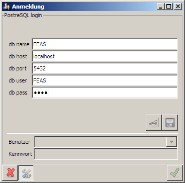
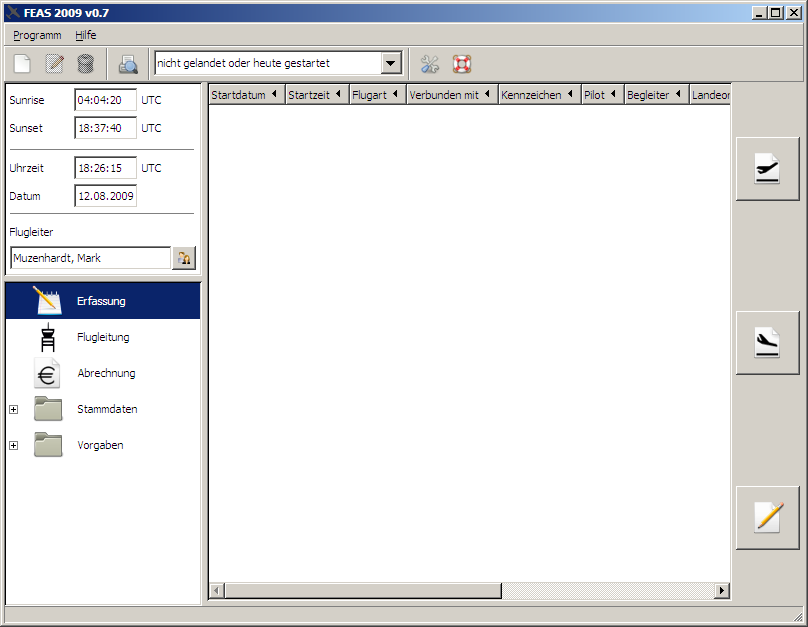

.. index::
   Erste Schritte

.. _ErsteSchritte:
   
==============
Erste Schritte
==============
   
.. topic:: Zusammenfassung
   Hier wird gezeigt, welche Einstellungen nach der Erstinstallation von FEAS notwendig sind.
   
.. index::
   Login
   
Login
=====   
Die FEAS-Installation legt ein Icon auf dem Desktop ab, welches den Name `FEAS` trägt. Mit einem Doppelklick auf dieses Symbol kann FEAS gestartet werden. Nun öffnet sich der Dialog `Anmeldung` und darüber eine Fehlermeldung die sagt, dass keine Verbindung zur angegebenen Datenbank hergestellt werden kann. Wird dieser Dialog mit `Ok` quittiert, erscheint im Anmeldefenster das `PostgreSQL login`. 

Hier sind folgende Eintragungen zu machen:

 * `db_name` - postgres
 * `db_host` - localhost
 * `db_port` - 5432
 * `db_user` - postgres
 * `db_pass` - Passwort, das bei der Installation vergeben wurde.

Anschließend ist die Eingabe mit dem Button `Verbindung herstellen` (Stecker-Symbol) zu prüfen. Waren die Eingaben korrekt, wird der Button ausgegraut und dafür der `Speichern`-Button rechts daneben freigegeben. Dieser ist nun auch anzuklicken, worauf man sich wieder im Anmeldedialog findet.

Da beim ersten Start noch keine Mitglieder vorhanden sind, ist im Feld `Benutzer` der `Administrator` auszuwählen. Nun wird der Button `Ok` (grüner Haken) aktiv, welcher FEAS mit einem Klick startet.

Nach einem kurzen Augenblick (FEAS legt beim ersten Start die Datenbanktabellen neu an) sollte man sich in der `Erfassung` von FEAS wiederfinden. Die Installation ist nun komplett, womit bei folgenden Anmeldungen keine erneute Datenbank-Konfiguration mehr notwendig ist.

Das Hauptprogramm
=================
Wenn das Login geglückt ist, dann sollte FEAS in das Hauptprogramm wechseln:

   
Das Hauptprogramm besteht aus drei Bereichen:

 * oben links: Hier zeigt FEAS Uhrzeit, Datum, Sunset, Sunrise und den angemeldeten Flugleiter an.
 * unten links: Alle Programmodule mit Aussnahme der Einstellungen sind ueber dieses Menue erreichbar.
 * Hauptfenster rechts: Das gerade im unteren, rechten Fenster ausgewaehlte Programmodul wird immer rechts angezeigt.

Nach dem ersten Start von FEAS funktioniert zunächst noch keine Flugdatenerfassung. Dies ist richtig so, weil vor der Flugdatenerfassung mindestens ein Eintrag in folgenden Rubriken zu machen ist:

Stammdaten/Mitglieder
---------------------
Es wird mindestens ein Mitglied benötigt, um einen Piloten angeben zu können.

Vorgaben/Flugarten
------------------
Es muss mindestens eine Flugart vorhanden sein. Wenn keine Gebührenabrechnung erfolgen soll, kann ein leerer Datensatz angelegt werden.

Stammdaten/Flugzeuge
-------------------- 
Mindestens ein Flugzeug muss vorhanden sein, um ein Flugzeug eintragen zu können. Zudem muss mindestens eine Flugart erlaubt sein, um einen Start zu protokollieren.

Die Menueleiste beinhaltet Standardoptionen und einen Flugrechner (der nur ueber das Menue Programm erreichbar ist). 
