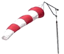

.. _Einführung:

==========
Einführung
==========
.. topic:: Zusammenfassung

   Dieses Kapitel ist eine Gesamtübersicht der bereits in FEAS implementierten Features.
    
    
Was ist FEAS?
=============
FEAS steht für "Flugdaten Erfassungs- und Auswertungs- System". Es wurde geschaffen, um immer wieder kehrende Buchführungsaufgaben eines Aeroclubs und der dort aktiven Mitglieder zu vereinfachen. Es existieren zum gegenwärtigen Zeitpunkt mehrere (meist kostenpflichtige) Programme, um Flugdaten zu erfassen. FEAS ist jedoch die einzige wirklich freie Software für diese Aufgabe, die auf dem deutschen Markt existiert. Das FEAS-Projekt ist unter der freien BSD-Lizenz veröffentlicht und kann deshalb von jedem frei von Lizenzgebühren weiterentwickelt und verteilt werden. 

Das Problem
-----------

    
Für gewöhnlich wird auf einem Flugplatz ein Start- und Landelogbuch in Form einer durch den Flugleiter von Hand auszufüllenden Tabelle geführt. Am Ende eines Flugtages müssen die Piloten all ihre Flüge aus der Tabelle herauspicken und in Ihr Flugbuch, sowie in das Bordbuch der jeweiligen Flugzeuge übertragen. Dazu kommt, dass auch die Flugzeiten "von Hand" berechnet werden müssen, was nicht nur mühselig sondern auch fehleranfällig ist. Am Ende des Monats ist für gewöhnlich die Abrechnung der Fluggebühren fällig, wofür die handgeschriebenen Start-/Landelogbücher abermals in eine andere Form gebracht werden müssen. Viele Vereine bewerkstelligen dies heutzutage mit einer Tabellenkalkulation, wobei jedoch trotzdem alle Daten wieder händisch eingegeben werden müssen.                                                 

Die Lösung
----------

    
Hier kommt FEAS ins Spiel. Es minimiert Fehlerquellen so weit wie möglich, indem es auf einmalig anzulegende Stammdaten aufsetzt. Es enthält Mitgliederverwaltung, Flugzeugparkverwaltung und Gebührenverwaltung. Auf Basis  dieser Stammdaten führt der Flugleiter nun sein Start-/Landelogbuch, wobei Falscheingaben weitestgehend ausgeschlossen werden. Noch während der Flugleiter einen Start oder eine Landung einträgt, werden die Gebühren gebucht. Damit sind alle zu zahlenden Beträge eines jeden Mitglieds stets aktuell und transparent. Am Ende des Flugtages kann das Start-/Landelogbuch durch verschiedene Berichte ausgewertet werden. Es stehen Berichte für Bordbuchzeiten, Hauptflugbuch, Ausbildungszeiten sowie Schleppzeiten zur Verfügung.           
 

 